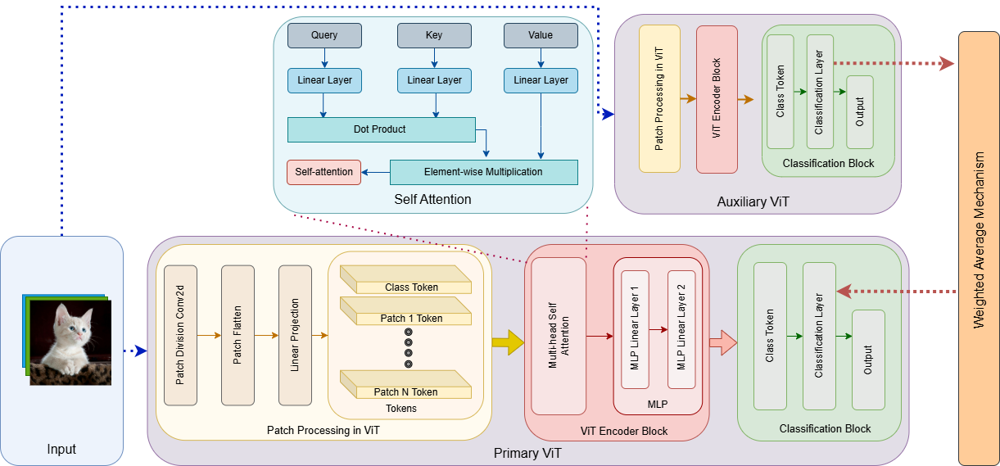

# Multi-Gradient Image Transformer (MGiT)

Welcome to the official repository for the Multi-Gradient Image Transformer (MGiT), a novel approach for optimizing Vision Transformers (ViTs) on limited datasets by using a dual-training system with an auxiliary ViT model.

## Abstract

Vision Transformers (ViTs) are well-known for capturing the global context of images using Multi-head Self-Attention (MHSA). However, compared to Convolutional Neural Networks (CNNs), ViTs typically exhibit a reduced inductive bias and require a larger volume of training image data to learn local feature representations. While various methods like the integration of CNN features or advanced pre-training strategies have been proposed to introduce this inductive bias, they often require significant architectural modifications or rely heavily on expansive pre-training datasets. This paper introduces a novel approach for training ViTs on limited datasets without altering the ViT architecture. We propose the Multi-Gradient Image Transformer (MGiT), which utilizes a parallel training method with a compact auxiliary ViT to adaptively optimize the weights of the target ViT. This approach yields significant performance improvements across diverse datasets and training scenarios. Our findings demonstrate that MGiT enhances ViT efficiency more effectively than traditional training methods. Furthermore, the application of Jensen-Shannon (JS) Divergence validates the convergence and alignment of feature understanding between the primary and auxiliary ViTs, thereby stabilizing the training process.

## Multi-Gradient Image Transformer (MGiT)

### Key Features

- **Efficiency**: MGiT reduces the need for large pre-training datasets.
- **Flexibility**: Compatible with standard ViT architectures without needing significant structural changes.
- **Enhanced Generalization**: Demonstrates improved performance on benchmark datasets through empirical evaluation.

## Code Release

The code for MGiT is currently under preparation and will be released soon. We are committed to providing a well-documented, robust implementation that can be easily integrated into existing projects.

## Installation

Instructions on how to install and set up MGiT will be provided here once the code is available.

## Usage

Upon release, this section will provide detailed instructions on how to implement MGiT in your projects, including sample code snippets and configuration settings.

## Contributing

We welcome contributions from the community. If you are interested in contributing to the MGiT project, please read through our contributing guidelines, which will be added to this repository. Contributions can include bug fixes, feature additions, and improvements to the documentation.

## License

This project is licensed under the MIT License - see the [LICENSE](LICENSE) file for details.

## Acknowledgments

- Acknowledge funders, contributors, and any inspiration drawn from other projects.
- Links to relevant resources or references used in the MGiT development.
